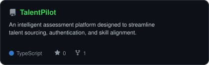
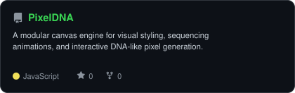
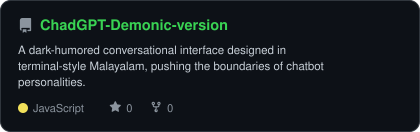
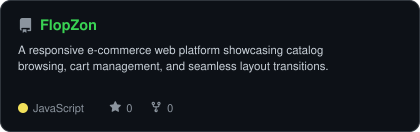

<div align="center">

<!-- PORTRAIT - generated by scripts/dotify.py from assets/jacket.png.
     Colour mode, so one file serves both GitHub themes. Regenerate with:
       python scripts/dotify.py assets/jacket.png -o assets/portrait \
         --cols 100 --equalize --detail 0.5 --color -->


<br>

<!-- NAME / TAGLINE - animated typing -->
<a href="https://github.com/3bin-05">
  
</a>

<br>

<!-- SOCIALS -->
<a href="https://www.linkedin.com/in/ebin-reji/"></a>
<a href="mailto:ebin05reji@gmail.com"></a>
<a href="https://www.ebinreji.online"></a>
<a href="https://www.instagram.com/_simply._.ebin_?igsh=MWZkOTdoZnJvOG1pdw%3D%3D"></a>


</div>

---

## `~/` whoami

```console
$ cat about.txt
```

Hi, I'm **Ebin Reji**. I build things that sit somewhere between software engineering and the web,
and I solve problems for fun when neither of those is cooperating.

- Currently building **[TalentPilot](https://github.com/3bin-05/TalentPilot)** and **[PixelDNA](https://github.com/3bin-05/PixelDNA)**
- Portfolio: **[ebinreji.online](https://www.ebinreji.online)**
- Learning **Fullstack Development + Mobile Apps (Flutter)**
- Fun fact: **I started coding seriously because I wanted to build things I wished existed.**

<br>

<div align="center">

## `~/` toolbox


</div>

---

<div align="center">

## `~/` skill radar

<table>
<tr>
<td width="50%" align="center" valign="middle">

<!-- Self-rated radar - edit assets/skills.json, the workflow redraws it -->
<picture>
  <source media="(prefers-color-scheme: dark)"  srcset="assets/radar-dark.svg?v=2">
  <source media="(prefers-color-scheme: light)" srcset="assets/radar-light.svg?v=2">
  
</picture>

</td>
<td width="50%" align="center" valign="middle">

<!-- Live radar built from real language byte counts across your repos -->
<picture>
  <source media="(prefers-color-scheme: dark)"  srcset="assets/radar-langs-dark.svg?v=2">
  <source media="(prefers-color-scheme: light)" srcset="assets/radar-langs-light.svg?v=2">
  
</picture>

</td>
</tr>
</table>

</div>

---

<div align="center">

## `~/` contribution calendar

<!-- 3D isometric calendar, regenerated every 6h by .github/workflows/metrics.yml -->


<br><br>

<!-- Snake eats the contribution graph - .github/workflows/snake.yml -->
<picture>
  <source media="(prefers-color-scheme: dark)"  srcset="https://raw.githubusercontent.com/3bin-05/3bin-05/output/snake-dark.svg">
  <source media="(prefers-color-scheme: light)" srcset="https://raw.githubusercontent.com/3bin-05/3bin-05/output/snake.svg">
  
</picture>

</div>

---

<div align="center">

## `~/` the numbers

<!-- Generated by scripts/cards.py into this repo. Deliberately NOT
     github-readme-stats / streak-stats / github-profile-trophy: those are
     shared public instances that go down and take the whole section with them. -->
<picture>
  <source media="(prefers-color-scheme: dark)"  srcset="assets/card-stats-dark.svg?v=2">
  <source media="(prefers-color-scheme: light)" srcset="assets/card-stats-light.svg?v=2">
  
</picture>

<br>


<br><br>


</div>

---

<div align="center">

## `~/` selected work

<!-- Cards generated by scripts/cards.py from assets/projects.json.
     Stars, forks and language are pulled live from the API on every run. -->
<table>
<tr>
<td width="50%">
  <a href="https://github.com/3bin-05/TalentPilot">
    <picture>
      <source media="(prefers-color-scheme: dark)"  srcset="assets/card-TalentPilot-dark.svg">
      <source media="(prefers-color-scheme: light)" srcset="assets/card-TalentPilot-light.svg">
      
    </picture>
  </a>
</td>
<td width="50%">
  <a href="https://github.com/3bin-05/PixelDNA">
    <picture>
      <source media="(prefers-color-scheme: dark)"  srcset="assets/card-PixelDNA-dark.svg">
      <source media="(prefers-color-scheme: light)" srcset="assets/card-PixelDNA-light.svg">
      
    </picture>
  </a>
</td>
</tr>
<tr>
<td width="50%">
  <a href="https://github.com/3bin-05/ChadGPT-Demonic-version">
    <picture>
      <source media="(prefers-color-scheme: dark)"  srcset="assets/card-ChadGPT-Demonic-version-dark.svg">
      <source media="(prefers-color-scheme: light)" srcset="assets/card-ChadGPT-Demonic-version-light.svg">
      
    </picture>
  </a>
</td>
<td width="50%">
  <a href="https://github.com/3bin-05/FlopZon">
    <picture>
      <source media="(prefers-color-scheme: dark)"  srcset="assets/card-FlopZon-dark.svg">
      <source media="(prefers-color-scheme: light)" srcset="assets/card-FlopZon-light.svg">
      
    </picture>
  </a>
</td>
</tr>
</table>

<sub>

| project | live | stack |
|---|---|---|
| **[TalentPilot](https://github.com/3bin-05/TalentPilot)** | [talentpilot.vercel.app](https://github.com/3bin-05/TalentPilot) | `JavaScript` `Node.js` `Auth` |
| **[PixelDNA](https://github.com/3bin-05/PixelDNA)** | [pixeldna.vercel.app](https://github.com/3bin-05/PixelDNA) | `JavaScript` `CSS` `Web Audio` |
| **[ChadGPT-Demonic-version](https://github.com/3bin-05/ChadGPT-Demonic-version)** | [chadgpt-demonic.vercel.app](https://github.com/3bin-05/ChadGPT-Demonic-version) | `Python` `AI` `Terminal` |
| **[FlopZon](https://github.com/3bin-05/FlopZon)** | [flopzon.vercel.app](https://github.com/3bin-05/FlopZon) | `JavaScript` `HTML` `CSS` |

## 💼 Experience

<details>
  <summary><b>🔧 Mulearn SBC — Technical Associate</b> · Apr 2026 – Present · Patoor, Kerala</summary>
  <br/>
  <blockquote>
    <code>Python</code> <code>React</code> <code>Community Tech</code> <code>Open Source</code>
  </blockquote>

  - Supporting technical initiatives and community-driven projects within Mulearn SBC
  - Collaborating on developer tooling and internal platforms for the student community
  - Mentoring peers on development best practices and project architecture
</details>

<details>
  <summary><b>🎨 Mulearn SBC — UI/UX IG Lead</b> · Aug 2025 – Apr 2026 · Patoor, Kerala</summary>
  <br/>
  <blockquote>
    <code>Figma</code> <code>UX Research</code> <code>Design Thinking</code> <code>Prototyping</code>
  </blockquote>

  - Mentored **50+ students** in UI/UX principles, design thinking, and prototyping techniques
  - Coordinated collaborative projects solving real-world problems through user-centered design
  - Led workshops and critique sessions that improved design output quality across the cohort
</details>

<details>
  <summary><b>📡 IEEE SB SBCE — Membership Development Coordinator</b> · Mar 2026 – Present · Patoor, Kerala</summary>
  <br/>
  <blockquote>
    <code>Community Building</code> <code>Event Management</code> <code>Leadership</code>
  </blockquote>

  - Driving membership growth and engagement initiatives within the IEEE Student Branch
  - Strategizing outreach campaigns to onboard new student members
  - Liaising between student interests and IEEE chapter leadership
</details>

<details>
  <summary><b>📅 IEEE SB SBCE — Program Coordination Team</b> · Jun 2025 – Mar 2026 · Patoor, Kerala</summary>
  <br/>
  <blockquote>
    <code>Event Coordination</code> <code>Logistics</code> <code>Tech Evangelism</code>
  </blockquote>

  - Coordinated logistics and scheduling for IEEE events, improving **attendance by 30%**
  - Facilitated knowledge-sharing sessions on emerging technologies and industry trends
  - Managed cross-team communication to ensure smooth event execution
</details>

<details>
  <summary><b>🌐 The Purple Movement — UI/UX Developer</b> · Aug 2025 – Present · Thiruvananthapuram, Kerala</summary>
  <br/>
  <blockquote>
    <code>Figma</code> <code>React</code> <code>Accessibility</code> <code>Usability Testing</code>
  </blockquote>

  - Designed and developed accessible, responsive interfaces for digital products
  - Conducted user research and usability testing to iterate on prototypes
  - Delivered production-ready UI components aligned with brand identity
</details>

<details>
  <summary><b>⚙️ TinkerHub SBCE — Tech Team Member</b> · Sept 2025 – Jan 2026 · Patoor, Kerala</summary>
  <br/>
  <blockquote>
    <code>Collaborative Coding</code> <code>Open Source</code> <code>Hackathons</code>
  </blockquote>

  - Contributed to technical projects and collaborative coding initiatives within the TinkerHub community
  - Participated in build sprints and peer code reviews
</details>

---

## 🏅 Achievements

<div align="center">

| | Achievement | Details |
|--|-------------|---------|
| 🎓 | **NPTEL Certification** | The Joy of Computing with Python — National Programme on Technology Enhanced Learning |
| 🎨 | **UI/UX IG Lead** | Mentored **50+ students** at Mulearn SBC in design thinking & prototyping |
| 📡 | **IEEE Member** | Active IEEE member since Mar 2025 — Program Coord → Membership Dev |
| 🌐 | **Mulearn Foundation Core Team** | UI/UX Core Team Member at Mulearn Foundation, Thiruvananthapuram (Dec 2025 – Present) |
| 📈 | **Event Impact** | Improved IEEE event attendance by **30%** through optimized coordination |
| 🚀 | **Live Portfolio** | Personal portfolio live at [ebin-reji.vercel.app](https://ebin-reji.vercel.app) with 3D physics-based components |

</div>

---

## 🎓 Education

<div align="center">

| Degree | Institution | Year | Score |
|--------|------------|------|-------|
| B.Tech in Computer Science & Engineering | Sree Buddha College of Engineering, APJ Abdul Kalam Technological University | 2023 – 2027 | In Progress |

</div>

---

## 📚 Currently Learning

```
🤖 Advanced ML Integration  →  Model fine-tuning, ONNX, edge deployment
☁️  Cloud & DevOps          →  Firebase, Vercel, CI/CD pipelines
🏗️  System Design           →  Scalable architecture, real-time systems
🔐 Security Engineering     →  End-to-end encryption, secure auth patterns
🎭 Creative Dev             →  Three.js, WebGL, scroll-based animations
```

---

<div align="center">

<sub>`01110100 01101000 01100001 01101110 01101011 01110011 00100000 01100110 01101111 01110010 00100000 01110011 01100011 01110010 01101111 01101100 01101100 01101001 01101110 01101110 01100111`</sub>

</div>
